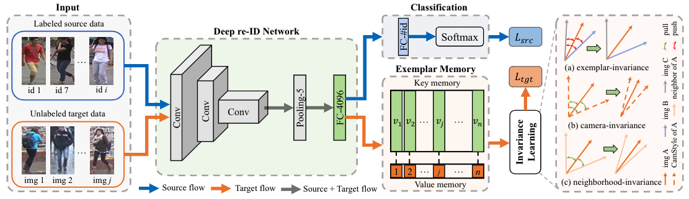
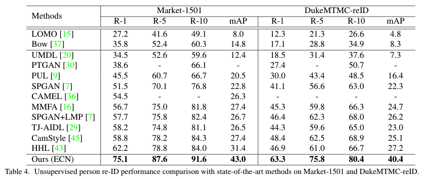
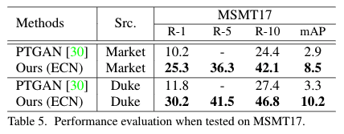

## Invariance Matters: Exemplar Memory for Domain Adaptive Person Re-identification CVPR 2019




### Preparation

#### Requirements: Python=3.6 and Pytorch>=1.0.0

1. Install [Pytorch](http://pytorch.org/)

2. Download dataset

   - Market-1501 [[BaiduYun]](http://pan.baidu.com/s/1ntIi2Op) [[GoogleDriver]](https://drive.google.com/file/d/0B8-rUzbwVRk0c054eEozWG9COHM/view?usp=sharing) CamStyle [[GoogleDriver]](https://drive.google.com/open?id=1klY3nBS2sD4pxcyUbSlhtfTk9ButMNW1) [[BaiduYun]](https://pan.baidu.com/s/1NHv1UfI9bKo1XrDx8g70ow) (password: 6bu4)
   
   - DukeMTMC-reID [[BaiduYun]](https://pan.baidu.com/s/1jS0XM7Var5nQGcbf9xUztw) (password: bhbh) [[GoogleDriver]](https://drive.google.com/open?id=1jjE85dRCMOgRtvJ5RQV9-Afs-2_5dY3O) CamStyle [[GoogleDriver]](https://drive.google.com/open?id=1tNc-7C3mpSFa_xOti2PmUVXTEiqmJlUI) [[BaiduYun]](https://pan.baidu.com/s/1NHv1UfI9bKo1XrDx8g70ow) (password: 6bu4)
   
   - MSMT17 + CamStyle [[BaiduYun]](https://pan.baidu.com/s/1NHv1UfI9bKo1XrDx8g70ow) (password: 6bu4) [[GoogleDriver]](https://drive.google.com/open?id=11I7p0Dr-TCC9TnvY8rWp0B47gCB3K0T4) We reformulate the structure of MSMT17 the same as Market-1501.
   
   - Unzip each dataset and corresponding CamStyle under 'ECN/data/'
   
   Ensure the File structure is as follow:
   
   ```
   ECN/data    
   │
   └───market OR duke OR msmt17
      │   
      └───bounding_box_train
      │   
      └───bounding_box_test
      │   
      └───bounding_box_train_camstyle
      | 
      └───query
   ```

### Training and test domain adaptation model for person re-ID

  ```Shell
  # For Duke to Market-1501
  python main.py -s duke -t market --logs-dir logs/duke2market-ECN
  
  # For Market-1501 to Duke
  python main.py -s market -t duke --logs-dir logs/market2duke-ECN
  
  # For Market-1501 to MSMT17
  python main.py -s market -t msmt17 --logs-dir logs/market2msmt17-ECN --re 0
  
  # For Duke to MSMT17
  python main.py -s duke -t msmt17 --logs-dir logs/duke2msmt17-ECN --re 0
  ```


### Results

 



       
### References

- [1] Our code is conducted based on [open-reid](https://github.com/Cysu/open-reid)

- [2] Camera Style Adaptation for Person Re-identification. CVPR 2018.

- [3] Generalizing A Person Retrieval Model Hetero- and Homogeneously. ECCV 2018.


### Citation

If you find this code useful in your research, please consider citing:

    @inproceedings{zhong2019invariance,
      title={Invariance Matters: Exemplar Memory for Domain Adaptive Person Re-identification},
      author={Zhong, Zhun and Zheng, Liang and Luo, Zhiming and Li, Shaozi and Yang, Yi},
      booktitle={Proceedings of IEEE Conference on Computer Vision and Pattern Recognition (CVPR)},
      year={2019},
    }

    
### Contact me

If you have any questions about this code, please do not hesitate to contact me.

[Zhun Zhong](http://zhunzhong.site)

